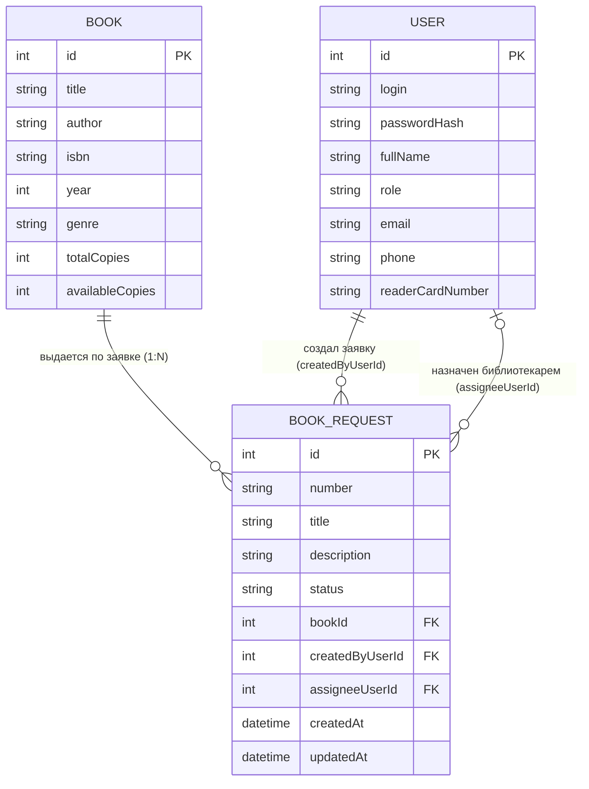

# Модель данных - АИС «БиблиоКонтроль»

## 1. Соответствие терминов

| Термин курса | Термин моей темы |
| --- | --- |
| Ticket (главный объект) | BookRequest (Заявка на выдачу книги) |
| Site (справочник) | Book (Книга) |
| User (пользователь) | User (Пользователь системы) |

---

## 2. Сущности и их атрибуты

### 2.1. BookRequest (Заявка на выдачу книги)

**Главный объект процесса** - запись о выдаче конкретной книги читателю.

| Поле | Тип | Описание |
| --- | --- | --- |
| `id` | int (PK) | Машинный первичный ключ (автоинкремент) |
| `number` | string | Человеческий номер заявки (например, REQ-2026-001) |
| `title` | string (5–80) | Название книги (заголовок заявки) |
| `description` | string (10–500) | Комментарий читателя / цель чтения |
| `status` | string | Статус заявки: `New`, `InProgress`, `Closed`, `Cancelled` |
| `bookId` | int (FK -> Book) | Ссылка на книгу (справочник) |
| `createdByUserId` | int (FK -> User) | Кто создал заявку (читатель) |
| `assigneeUserId` | int (FK -> User, nullable) | Назначенный библиотекарь (может быть пустым при создании) |
| `createdAt` | datetime | Дата и время создания заявки |
| `updatedAt` | datetime | Дата и время последнего изменения |

### 2.2. Book (Книга)

**Справочник** - каталог книг библиотеки.

| Поле | Тип | Описание |
| --- | --- | --- |
| `id` | int (PK) | Машинный первичный ключ |
| `title` | string | Название книги |
| `author` | string | Автор (ФИО) |
| `isbn` | string | ISBN (международный стандартный номер книги) |
| `year` | int | Год издания |
| `genre` | string | Жанр / категория |
| `totalCopies` | int | Общее количество экземпляров |
| `availableCopies` | int | Доступно для выдачи (не выдано) |

### 2.3. User (Пользователь системы)

**Пользователи** - читатели, библиотекари, заведующий филиалом.

| Поле | Тип | Описание |
| --- | --- | --- |
| `id` | int (PK) | Машинный первичный ключ |
| `login` | string (unique) | Логин для входа в систему |
| `passwordHash` | string | Хеш пароля (не хранится в открытом виде) |
| `fullName` | string | ФИО пользователя |
| `role` | string | Роль: `Reader` (читатель), `Librarian` (библиотекарь), `Manager` (заведующий) |
| `email` | string | Email для уведомлений |
| `phone` | string | Телефон |
| `readerCardNumber` | string (nullable) | Номер читательского билета (только для читателей) |

---

## 3. ER-диаграмма (Сущность–Связь)

## 4. Связи между сущностями (словами)

**Book -> BookRequest (1:N)**  
Одна книга может быть выдана много раз (в разных заявках).  
Одна заявка относится к одной конкретной книге.

**User (создатель) -> BookRequest (1:N)**  
Один читатель может создать много заявок.  
Одна заявка создана одним читателем.

**User (исполнитель) -> BookRequest (1:0..N)**  
Один библиотекарь может быть назначен на много заявок.  
У новой заявки исполнителя может не быть (`assigneeUserId` nullable).  
Одна заявка может быть назначена на одного библиотекаря.

---

## 5. Проверка третьей нормальной формы (3НФ)

**Проверка для справочника Book:**

> Название книги (`title`), автор (`author`), ISBN и другие атрибуты книги хранятся **только один раз** в таблице `Book`.  
> В таблице `BookRequest` хранится **только внешний ключ** `bookId` (число), а не название книги текстом.
>
> **Почему это 3НФ:**  
> Если мы захотим исправить опечатку в названии книги или добавить нового автора, нам нужно изменить **только одну строку** в таблице `Book`, а не десятки строк в `BookRequest`.  
> Если бы мы хранили название книги текстом в каждой заявке, то при переименовании книги пришлось бы править все заявки, что привело бы к ошибкам и несогласованности данных.

**Проверка для пользователя User:**

> ФИО пользователя, его роль и контактные данные хранятся **только один раз** в таблице `User`.  
> В таблице `BookRequest` хранятся **только внешние ключи** `createdByUserId` и `assigneeUserId` (числа), а не ФИО текстом.
>
> **Почему это 3НФ:**  
> Если читатель сменит фамилию или библиотекарь уволится, нам нужно изменить **только одну строку** в таблице `User`, а не все заявки.

---

## 6. Статусы и переходы

| Статус | Код | Описание | Кто может перевести |
| --- | --- | --- | --- |
| Новая | `New` | Заявка создана, ожидает обработки | Система (при создании) |
| Готовится к выдаче | `InProgress` | Библиотекарь готовит книгу к выдаче | Назначенный библиотекарь |
| Выдана | `Closed` | Книга выдана читателю | Назначенный библиотекарь |
| Отменена | `Cancelled` | Заявка отменена (нет в наличии, читатель передумал) | Библиотекарь или Заведующий |

**Важно:**
- Удаление заявок (`DELETE`) не используется. Отмена = статус `Cancelled`.
- Перевод из статуса в статус - отдельный `PATCH` запрос (не общий `UPDATE`).

---

## 7. Ключевые отличия `id` и `number`

| Поле | `id` | `number` |
| --- | --- | --- |
| **Тип** | int (число) | string (строка) |
| **Кто генерирует** | База данных (автоинкремент) | Сервер (по шаблону REQ-YYYY-NNN) |
| **Уникальность** | Гарантирована БД | Гарантирована бизнес-логикой |
| **Использование** | В API: `/api/requests/17` | Для человека: «Ваша заявка REQ-2026-042» |
| **Можно ли менять** | Нет | Нет |
| **Пример** | `17` | `REQ-2026-042` |

**Почему оба поля нужны:**
- `id` - быстрый технический ключ для базы данных и API.
- `number` - удобный для человека (читатель не запомнит `id=1742`, но запомнит `REQ-2026-042`).
